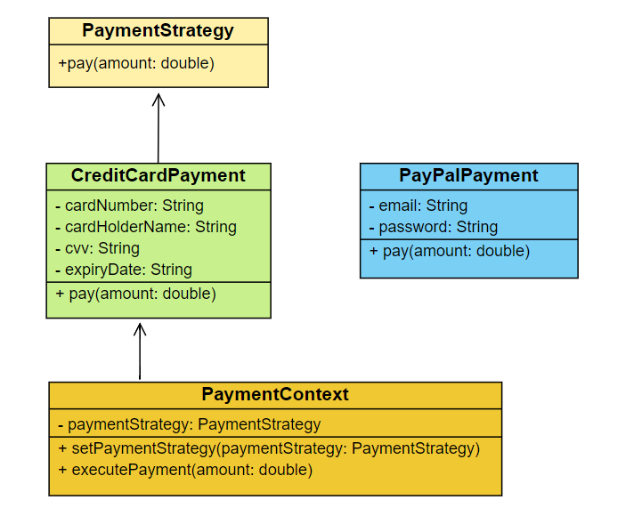

**Exercise 8: Implementing the Strategy Pattern**

{width="3.9368055555555554in"
height="3.1666666666666665in"}In the given scenario, a payment system is
developed using the Strategy Pattern, allowing dynamic selection of
different payment methods at runtime. The *PaymentStrategy* interface
defines a method *pay()*, implemented by *CreditCardPayment* and
*PayPalPayment* classes for specific payment types. The *PaymentContext*
class holds a reference to a *PaymentStrategy*, enabling the strategy to
be set and executed at runtime. The *StrategyPatternExample* test class
demonstrates selecting and using different payment strategies. This
approach provides flexibility and extensibility for adding new payment
methods without altering the existing code structure**.**

**Class Description :**

-   **PaymentStrategy:** This interface defines a strategy for payment
    with a single method *pay().* Concrete implementations will define
    how to perform the payment.

-   **CreditCardPayment:** Implements the PaymentStrategy interface. It
    simulates a credit card payment by holding card details and printing
    a message when the *pay()* method is called.

-   **PayPalPayment:** Implements the PaymentStrategy interface. It
    simulates a PayPal payment by holding PayPal account details and
    printing a message when the *pay()* method is called.

-   **PaymentContext:** This class holds a reference to a
    PaymentStrategy. It allows setting the payment strategy at runtime
    and executing the payment by calling the *pay()* method of the
    current strategy.

-   **StrategyPatternExample:** This is the test class with the main
    method. It demonstrates how to use the PaymentContext to select and
    use different payment strategies at runtime.

Here is the github repo link -
[link](https://github.com/Hyperstrom/Aniket-Pal_5017587/tree/main/WEEK-1/2.Design%20Patterns%20and%20Principles/Excercise-8)

Here is the ouput of the code --

{width="6.077252843394576in"
height="0.45128062117235346in"}
